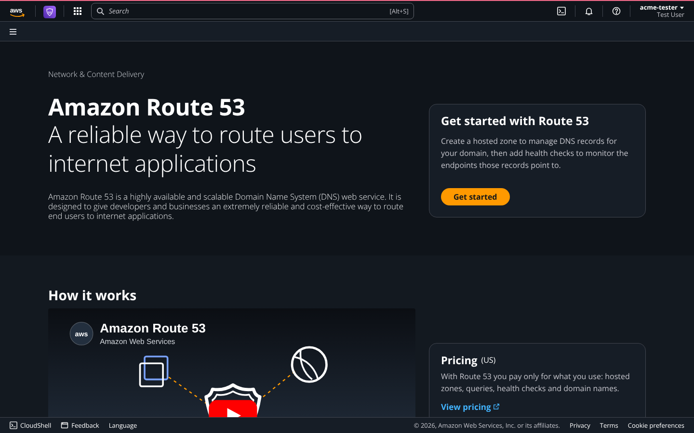
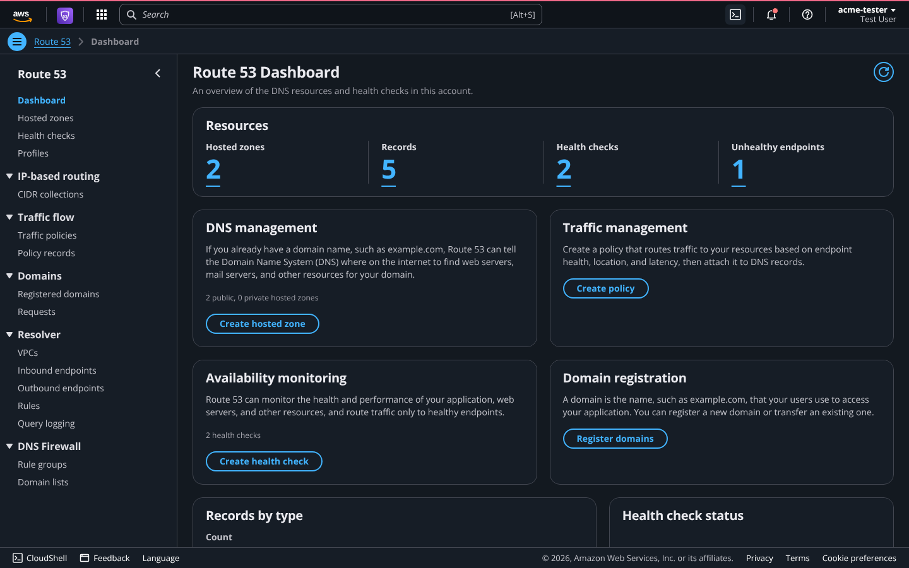
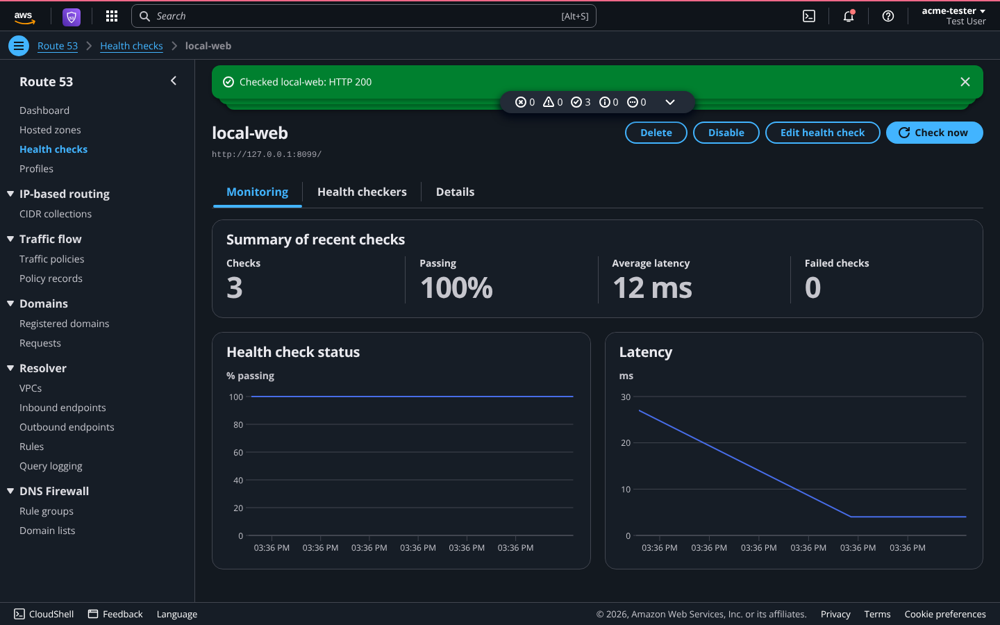
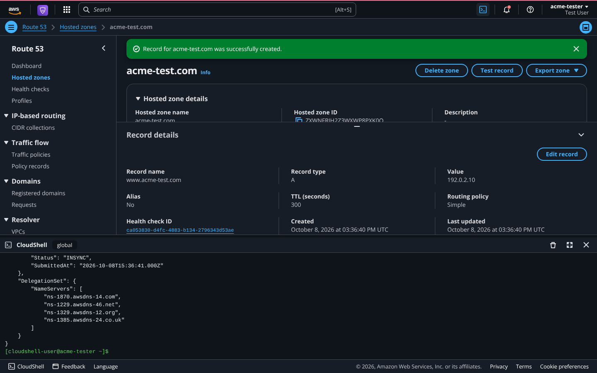
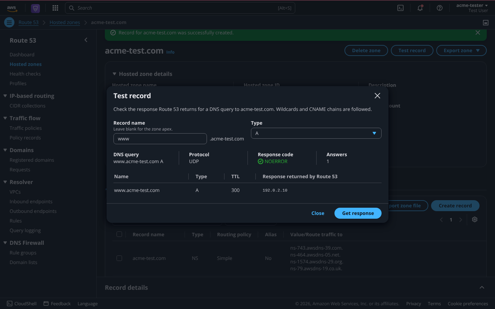
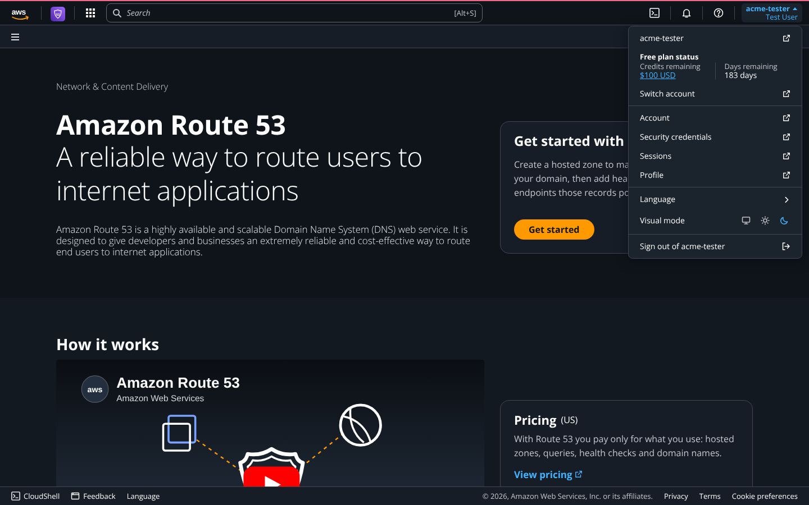
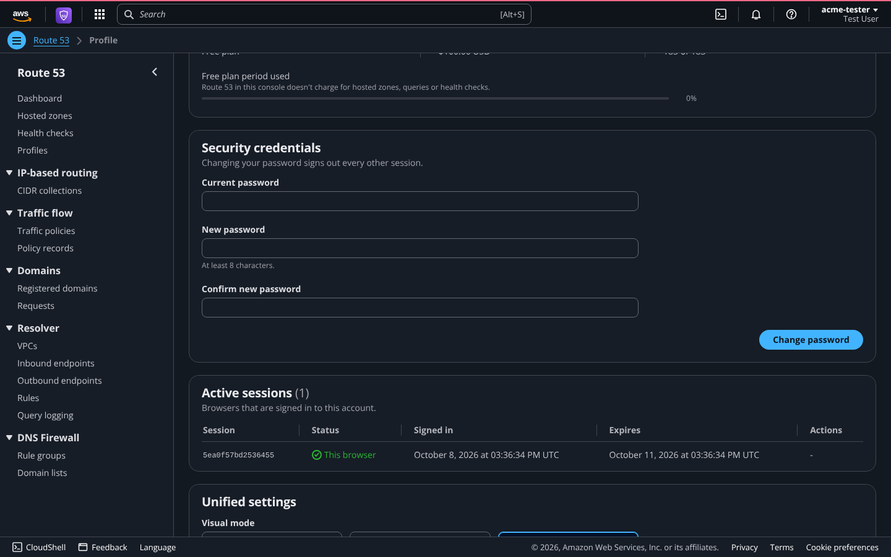

# AWS Route 53 Clone

A full-stack clone of the AWS Route 53 console. It has real accounts, hosted zones and DNS records, live health checks that probe your endpoints, a DNS "Test record" resolver, and a CloudShell terminal that runs `aws route53` commands against your data. The UI recreates the Route 53 console look using the same design system AWS uses. It does not serve DNS on port 53 to the internet.

| | |
|---|---|
| **Live app** | https://scaler-aws-route-53-clone.vercel.app/ |
| **API docs (Swagger)** | https://route53-clone-api-775i.onrender.com/api/docs |



## Try it

Open the live app and sign in with the demo account, or create your own.

| Field | Value |
|---|---|
| Account ID or alias | leave empty, or `123456789012` / `scaler-demo` |
| User name | `demo` |
| Password | `demo1234` |

The demo account comes with three sample hosted zones. Anyone can also sign up from the sign-in page; each account only sees its own data.

> The backend runs on a free Render instance. It sleeps when idle, so the first request after a quiet period can take up to a minute. Data is stored in SQLite on a non-persistent disk, so accounts, zones and records you create are reset when the service restarts or redeploys. The demo account is re-created automatically.

## Tech stack

| Layer | Technology |
|---|---|
| Frontend | Next.js 15 (App Router), React 19, TypeScript, AWS Cloudscape Design System, TanStack Query |
| Backend | FastAPI, SQLAlchemy 2, Pydantic 2, dnspython, httpx |
| Database | SQLite |
| Testing | pytest |
| Hosting | Vercel (frontend), Render (backend) |

## Features

**Console shell**

- AWS-style top bar: logo, services menu, global search (`Alt+S`) across pages, zones, records and health checks, CloudShell button, notifications bell with unread badge, help, and account menu.
- Account menu: account alias, Free plan status, links to profile and sessions, language, visual mode (browser default, light, dark) and sign out.
- Footer: CloudShell, Feedback (stored in the database), language, privacy, terms and cookie links.
- Dark mode by default, using the AWS console palette.

**Pages**

- **Landing page**: Route 53 introduction, pricing, resources, how it works, products, benefits and use cases.
- **Dashboard**: resource counters, records-by-type chart, health status chart and recent activity.
- **Hosted zones**: list, search, filter, paginate, create (public or private), view, edit, delete and bulk delete.
- **Records**: A, AAAA, CNAME, TXT, MX, NS, PTR, SRV and CAA with per-type validation and Route 53 rules (no duplicates, no CNAME at the apex or beside other records, protected apex NS and SOA). Create several at once, edit, delete, bulk delete, and attach a health check.
- **Test record**: asks the zone what Route 53 would answer for a name and type, following wildcards and CNAME chains, and returns NOERROR or NXDOMAIN.
- **Health checks**: HTTP, HTTPS and TCP checks with an IP address or domain name, port, path, optional string matching, 10 or 30 second interval, failure threshold, invert and disable. A background checker probes every endpoint on its interval. The details page shows status and latency charts and the result history.
- **Profile**: account details, change password (signs out other sessions), active sessions with sign-out, and visual mode.
- **Sign up and sign in**: each account gets its own 12-digit account ID.
- "Coming soon" pages for Profiles, Traffic policies, Domains, Resolver and DNS Firewall.

**Extras**

- **CloudShell**: a terminal that runs a subset of the AWS CLI (`aws route53 list-hosted-zones`, `create-hosted-zone`, `change-resource-record-sets`, `test-dns-answer`, `create-health-check`, `get-health-check-status` and more; type `help`). Output is AWS-style JSON.
- **Import and export**: BIND zone file import with preview, and export as BIND or JSON.
- **Notifications**: every change and every health status flip is logged and shown in the notifications drawer.
- **Keyboard shortcuts** (press `?`): `Alt+S` search, `Alt+T` CloudShell, `Alt+M` visual mode, `g` then `h/d/z/c/p` to navigate, `c` to create, `/` to filter.

| Dashboard | Health check |
|---|---|
|  |  |
| **CloudShell** | **Test record** |
|  |  |
| **Account menu** | **Profile** |
|  |  |

## Architecture

```
Browser ──► Next.js on Vercel ──/api/* rewrite──► FastAPI on Render ──► SQLite
             App Router + Cloudscape               routes → controllers → services → models
                                                   background health checker (asyncio + httpx)
```

- `/api/*` is proxied through a Next.js rewrite, so the session cookie is first-party and secure.
- `middleware.ts` sends visitors without a session to `/login`; the API validates the session token on every request.
- The backend is split into domain modules. Each module has its own `models`, `schemas`, `service`, `controller` and `routes`.
- The zones and records services back both the REST API and the CloudShell CLI, so both apply the same validation and write the same activity log.
- The health checker runs inside the API process. Each probe is an HTTP(S) GET or a TCP connect with a 4 second connect and 2 second read timeout; 2xx and 3xx count as healthy. Targets that resolve to private addresses are refused.
- New database columns are added automatically on startup, so upgrades keep existing data.

### Project structure

```
backend/app/
  main.py, seed.py
  core/      config, db, errors, dns_rules, schemas (Page, bulk delete), timeutil
  modules/   auth (+ security), zones (+ exporter), records (+ resolver, zonefile),
             healthchecks (+ probe, checker), activity, dashboard, search, feedback,
             cli (+ parser, serializers, commands)
backend/tests/         API and feature tests
frontend/src/
  app/                 login, signup, (console)/ pages: landing, dashboard, hostedzones, healthchecks, profile
  components/          console layout, shell (top bar, search, account menu, CloudShell, footer), forms, tables, modals
  lib/                 API client, query hooks, DNS helpers, types, navigation
render.yaml            Render blueprint for the backend
```


## Database schema

```
users (id, username, password_hash, account_id UNIQUE, account_alias UNIQUE, display_name, email, created_at)
sessions (token PK, user_id → users, created_at, expires_at)
hosted_zones (id PK, owner_id → users, name, is_private, comment, caller_reference, vpc_region, vpc_id, ...)
record_sets (id, zone_id → hosted_zones, name, type, ttl, routing_policy, health_check_id → health_checks
             ON DELETE SET NULL, ..., UNIQUE(zone_id, name, type))
record_values (id, record_set_id → record_sets, value, position)
health_checks (id PK, owner_id → users, name, protocol, ip_address, domain_name, port, resource_path,
               search_string, request_interval, failure_threshold, inverted, disabled, status,
               consecutive_failures, consecutive_successes, last_checked_at, last_latency_ms, last_message, ...)
health_check_results (id, health_check_id → health_checks, checked_at, success, latency_ms, status_code, message)
activity (id, owner_id → users, action, resource_type, resource_id, message, created_at)
feedback (id, owner_id → users, rating, message, page, created_at)
```

Deletes cascade from users to everything they own, and from zones to records. Only the latest 500 results are kept per health check.

## API overview

Interactive documentation: https://route53-clone-api-775i.onrender.com/api/docs

All endpoints are under `/api`. Apart from login, register, config and health, they need the session cookie.

| Method | Path | Description |
|---|---|---|
| GET | `/auth/config` | Whether sign-up and the demo account are enabled |
| POST | `/auth/register` | Create an account and sign in |
| POST | `/auth/login` / `/auth/logout` | Sign in (`account_id` or alias, `username`, `password`) / out |
| GET, PATCH | `/auth/me` | Current user / update name, email, alias |
| POST | `/auth/change-password` | Change password and sign out other sessions |
| GET, DELETE | `/auth/sessions`, `/auth/sessions/{id}` | List or revoke sessions |
| GET, POST | `/hostedzones` | List (`search`, `type`, `page`, `page_size`) / create |
| GET, PATCH, DELETE | `/hostedzones/{id}` | Zone details / update comment / delete |
| POST | `/hostedzones/bulk-delete` | Delete several zones |
| GET | `/hostedzones/{id}/export?format=bind\|json` | Download the zone |
| GET | `/hostedzones/{id}/test-dns?name=&type=` | Test record |
| GET, POST | `/hostedzones/{id}/records` | List / create (`name`, `type`, `ttl`, `values`, `health_check_id`) |
| GET, PATCH, DELETE | `/hostedzones/{id}/records/{rid}` | Record details / update / delete |
| POST | `/hostedzones/{id}/records/bulk-delete`, `/records/import` | Bulk delete / import a BIND file |
| GET, POST | `/healthchecks` | List (`search`, `status`, paging) / create (runs the first check right away) |
| GET, PATCH, DELETE | `/healthchecks/{id}` | Details / update / delete |
| POST | `/healthchecks/{id}/check` | Check now |
| GET | `/healthchecks/{id}/results` | Recent probe results |
| POST | `/healthchecks/bulk-delete` | Delete several health checks |
| GET | `/dashboard`, `/activity`, `/search?q=` | Dashboard data, activity log, global search |
| POST | `/cli` | Run a CloudShell command (`{ "command": "aws route53 ..." }`) |
| POST | `/feedback` | Send feedback |
| GET | `/health` | Service health |


## What is simulated

Billing and IAM are simplified: each account has one user, and the Free plan credits are display-only. Alias records, non-simple routing policies, DNSSEC, tags, domain registration, traffic flow and Resolver are disabled or marked "Coming soon". DNS answers are available through Test record and the CloudShell CLI, not on port 53.
